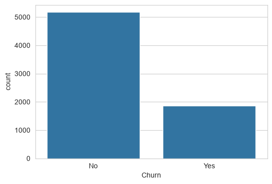
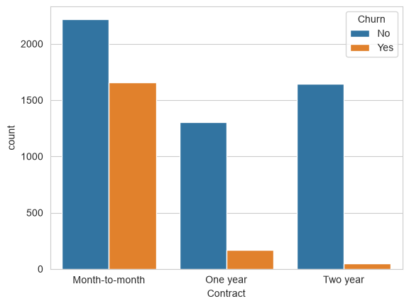
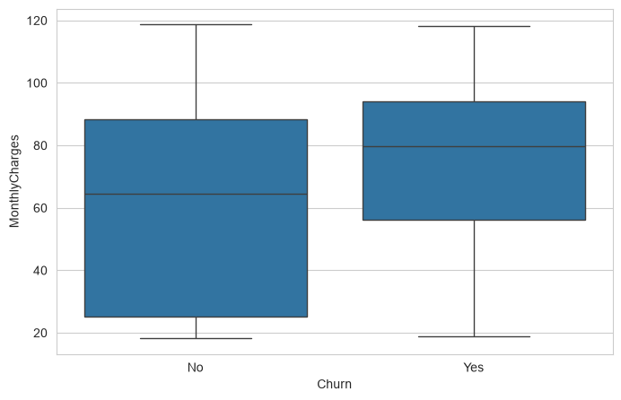
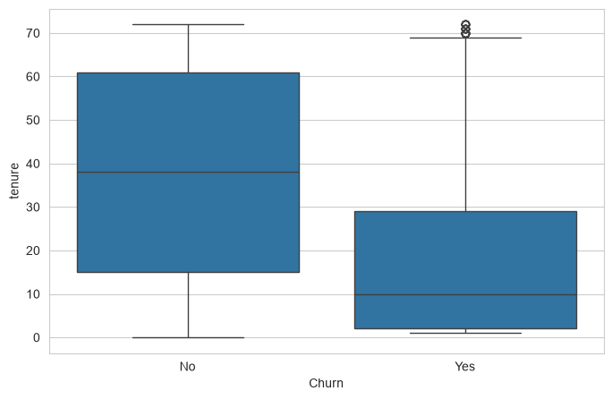
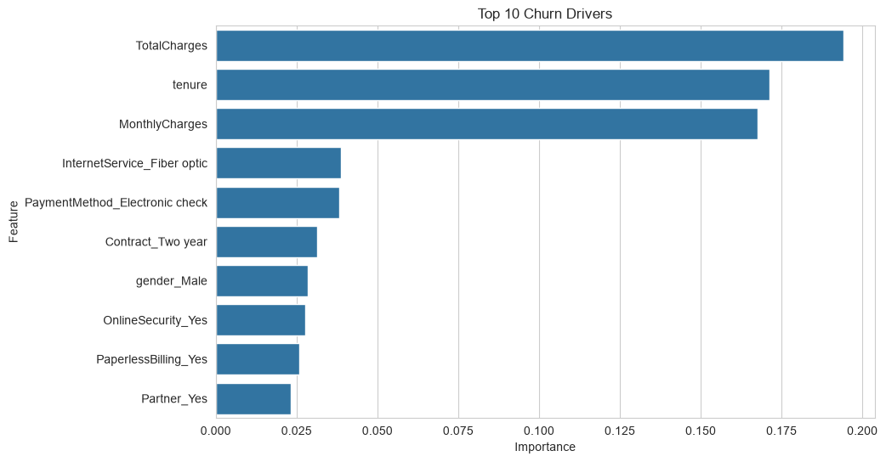
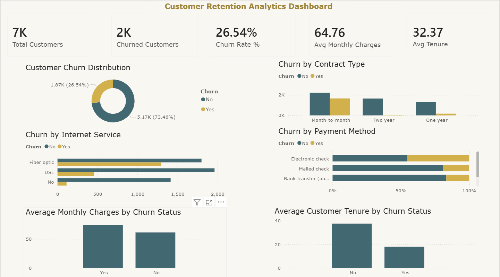

# Customer Churn Prediction System

## Project Overview

This project develops a machine learning solution to predict customer churn using the IBM Telco Customer Churn dataset. The objective is to identify customers who are likely to discontinue services and uncover the key factors influencing churn behavior.

The project covers the complete data science workflow, including data cleaning, exploratory data analysis, feature engineering, model development, evaluation, and business insight generation.

---

## Business Problem

Customer churn directly impacts revenue and customer acquisition costs. By identifying customers at risk of leaving, organizations can implement targeted retention strategies and improve long-term customer value.

This project aims to answer:

* Which customers are most likely to churn?
* What factors contribute most to customer churn?
* How can businesses reduce churn and improve retention?

---

## Dataset

**Dataset:** IBM Telco Customer Churn Dataset

### Dataset Summary

* Records: 7,043 customers
* Features: 21 customer attributes
* Target Variable: Churn (Yes / No)

### Key Features

* Demographics
* Contract Information
* Internet Services
* Payment Methods
* Monthly Charges
* Total Charges
* Customer Tenure

---

## Project Workflow

### 1. Data Cleaning

* Checked data quality and structure
* Converted TotalCharges to numeric format
* Handled missing values
* Removed unnecessary identifiers

### 2. Exploratory Data Analysis

Performed analysis on:

* Churn Distribution
* Contract Type vs Churn
* Internet Service vs Churn
* Tenure vs Churn
* Monthly Charges vs Churn
* Demographic Factors

### 3. Feature Engineering

* Target variable encoding
* One-hot encoding of categorical features
* Feature scaling for Logistic Regression
* Train-test data splitting

### 4. Model Building

Implemented and compared:

#### Logistic Regression

* Accuracy: 80.70%

#### Random Forest Classifier

* Accuracy: 78.99%

### 5. Model Evaluation

Evaluation metrics:

* Accuracy Score
* Confusion Matrix
* Classification Report
* ROC Curve
* AUC Score

### 6. Feature Importance Analysis

Identified the most influential churn drivers:

1. Total Charges
2. Tenure
3. Monthly Charges
4. Internet Service (Fiber Optic)
5. Payment Method (Electronic Check)
6. Contract Type
7. Online Security
8. Paperless Billing

---

## Key Business Insights

### Customer Retention Risk

Customers with shorter tenure demonstrate significantly higher churn rates.

### Pricing Impact

Higher monthly charges are associated with increased churn probability.

### Contract Influence

Month-to-month customers churn considerably more than customers on long-term contracts.

### Service Factors

Customers without online security and support services exhibit higher churn tendencies.

### Payment Behavior

Electronic check users display higher churn rates compared to other payment methods.

---

## Technologies Used

* Python
* Pandas
* NumPy
* Matplotlib
* Seaborn
* Scikit-learn
* Jupyter Notebook
* Pickle

---

## Project Structure

```text
customer-churn-prediction/
│
├── data/
├── notebooks/
├── models/
├── images/
├── src/
├── requirements.txt
└── README.md
```

---

## Visualizations

### Churn Distribution



### Contract Type vs Churn



### Monthly Charges vs Churn



### Tenure vs Churn



### Feature Importance



---

## Model Performance

| Model               | Accuracy |
| ------------------- | -------- |
| Logistic Regression | 80.70%   |
| Random Forest       | 78.99%   |

### Best Performing Model

**Logistic Regression**

Achieved the highest classification accuracy and provided strong interpretability for business decision-making.

---

## Power BI Dashboard

An interactive Customer Retention Analytics Dashboard was developed in Power BI to monitor churn trends, customer behavior, and retention risk factors.

### Dashboard Highlights

- Customer Churn Rate Analysis
- Contract Type Impact on Churn
- Internet Service Churn Trends
- Payment Method Analysis
- Average Monthly Charges by Churn Status
- Average Customer Tenure by Churn Status

### Dashboard Preview



## Future Improvements

* Hyperparameter tuning
* XGBoost implementation
* Customer lifetime value prediction
* Interactive dashboard deployment
* Real-time churn prediction API

---

## Author

**Snehal Roy**

Data Analyst | Data Science Enthusiast
